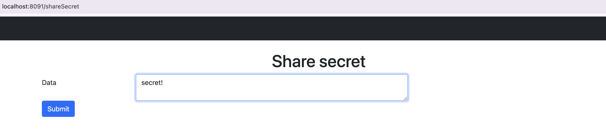
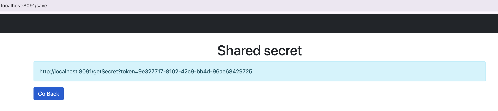
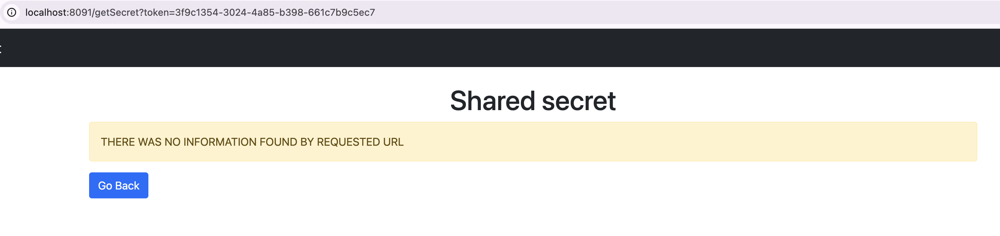

## Getting Started
### Guides
The following guides illustrate how to start all applications:
1. Run following command in the root of the project to start all the services:
```
docker-compose build --no-cache
docker-compose up -d
```
2. User Flow:

- Open main page http://localhost:8091/shareSecret and login as admin/admin
- Enter some secret data and click submit.

-  A URL will be generated (e.g. http://localhost:8091/getSecret?token=3f9c1354-3024-4a85-b398-661c7b9c5ec7).

- Share yous secret URL with a friend. Keep in mind that once opened, the secret will be immediately deleted.


